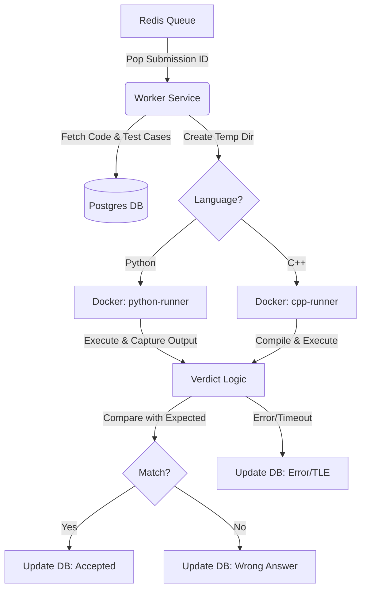

# Online Judge Worker

This worker is a generic code execution engine written in Rust. It consumes submission jobs from a Redis queue, executes the code in isolated Docker containers, and updates the results in a PostgreSQL database.

## Architecture

*(Note: Mermaid diagram source below)*

## How It Works (Step-by-Step)

1.  **Job Pickup**: The worker listens on a Redis queue (`brpop`). When a web server pushes a `submission_id`, the worker picks it up immediately.
2.  **Data Fetching**: It uses the ID to query the Postgres database for:
    *   **The Code**: What the user wrote.
    *   **The Language**: Python, C++, etc.
    *   **Test Cases**: Inputs and expected outputs.
3.  **Isolation (Docker)**:
    *   The worker creates a unique temporary folder on the host machine.
    *   It writes the user's code into this folder (e.g., `solution.py`).
    *   It spins up a **Docker container** with network disabled (for security).
    *   It mounts the temporary folder into the container so the code is visible inside.
4.  **Execution**:
    *   **Python**: Runs `python solution.py` inside the container.
    *   **C++**: First runs `g++` to compile, then runs the binary.
    *   Input is piped into standard input (stdin).
    *   Output is captured from standard output (stdout).
5.  **Judging**: The worker compares the container's output (stdout) against the database's `expected_output`.
    *   **Accepted**: Output matches perfectly (ignoring trailing whitespace).
    *   **Wrong Answer**: Output is different.
    *   **Time Limit Exceeded**: The process took too long.
    *   **Runtime Error**: The code crashed (non-zero exit code).
6.  **Result**: The final verdict and execution stats (time/memory) are saved back to Postgres.

## Directory Structure

*   `src/main.rs`: Entry point. Initializes config, DB, and starts the worker.
*   `src/services/queue.rs`: Handles Redis communication.
*   `src/services/executor.rs`: The core logic. Handles Docker creation, file mounting, and running code.
*   `src/models/`: Data structures matching your DB tables.

## Docker Images
The system relies on two custom images which must be built locally:
*   `klaus-judge-python`: For Python execution.
*   `klaus-judge-cpp`: For C++ compilation and execution.
